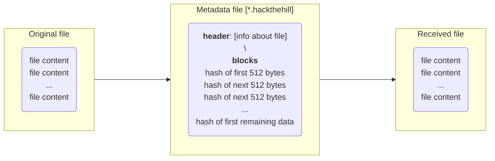

<h1> Peer-to-Peer network </h1>

<h2> By: <i>The IKEA boys</i></h2>

    <a href="#inspiration">Inspiration</a> •
    <a href="#what-it-does">What It Does</a> •
    <a href="#how-we-built-it">How We Built It</a> •
    <a href="#challenges-we-ran-into">Challenges</a> •
    <a href="#accomplishments-that-were-proud-of">Accomplishments</a> •
    <a href="#what-we-learned">What We Learned</a> 

## Inspiration
People deserve the privacy that is not provided to them often. In such cases, it's often easy to forget how much vulnerable sharing protocols make us, and how they are often abused.

We wanted to learn the whole network aspect of software engineering, which was new to all of us, to understand how stuff around us works, and how we can make it safe for our community.  

## What it does
That's the meat of it. We privately send files between two or more devices.

We create a private connection network between devices to act as a decentralized file sharing platform. Each device acts both as a client and a server, and each file is shared as a combination of smaller decentralized chunks.

This protocol makes the sharing resilient against data loss, disconnections, and outages; and therefore, greatly reduces redundant downloads. It also has a frontend for the user to interact with. 

## How we built it
We implemented our TCP/IP communication layer using python. Then wrapping it with the intuitive NextJS UI.

On node instantiation its location gets advertised to all the listening connections on the local network.

If a node wants to share data it first tokenizes it by generating header information like file name, size and type, then the contents of the file are divided in 512 byte blocks, each block is hashed using a hash-function and inserted in an indexed block object. This gives us a metadata file (with the extension `.hackthehill`) which stores all information needed to re-create the original file.
> Another implementation detail: We store the data in blocks of 512 bytes to account for network disruptions. If it happens that the network gets disrupted when the file is being converted back to the original file, the program remembers how many bytes had been un-hashed and will continue from where it was before the disruption.

> The metadata file uses JSON formatting to store the data, which is easy to parse.

Whenever a node needs to retrieve some information it asks its network peers for the file unique identifier, if it's present the sender node transfers the `.hackthehill` file (aka the meta-data file) to the receiver, which makes use of it to retrieve the the blocks necessary to assemble the resulting downloadable file.

The file is uploadable and downloadable using our NextJS frontend, where two nodes on the same network can send/receive files to other nodes.

## Challenges we ran into
Being a new technology for us, it was a challenge to learn the basic fundamentals of networking and implement them right away.

A lot of concepts that we took for granted, like firewall protection and communication through ip addresses, they challenged our interpretation about the networking world. They were also major roadblocks that motivated us to keep upgrading our project to incorporate changes.

One major roadblock we ran into was the matter of two nodes communicating and sending the .hackthehill file object. It took a deeper understanding of IPs and networks to get the insight into uOttawa's mesh wifi system, which way to connect with one another, and how to use multi-threading processing to get data in real time. 

## Accomplishments that we're proud of
It took a mastery of Git for us to incorporate our different approaches to the same problem. And the record time that it took for us to understand and implement networking protocols surprised even us. We had to scratch a lot of first attempt, we had to approach the problem from a lot of different views and perspectives. Creating a network without a central server where every node is capable of sending and receiving is something we're proud to have managed!

## What we learned
We learnt about how networking actually works, and how communication happens over deep layers of networks around the world. We also learned how many things one needs to keep in mind while establishing networks and being able to implement something as simple as file sharing. We also learned how to use web-sockets and threading and how to establish secure connections over a wireless network.
